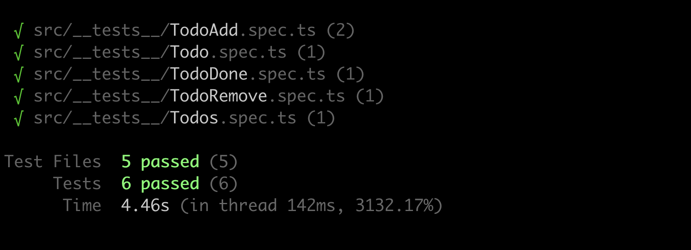
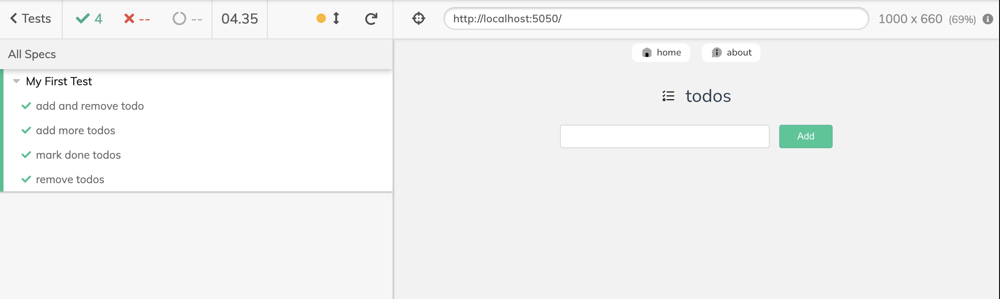

<p align='center'>
  
</p>

<p align='center'>
  <a href="https://vuejs-todos.netlify.app/">Todo App</a>
</p>

<br>

## Technologies used

- 🦾 TypeScript
- ⚡️ [Vue 3](https://github.com/vuejs/core) - An approachable, performant and versatile framework 
- ⚡️ [Vite](https://github.com/vitejs/vite) - Next Generation Frontend Tooling
- 🍍 [State Management via Pinia](https://pinia.esm.dev/)
- ⚙️ Unit Testing with [Vitest](https://github.com/vitest-dev/vitest), E2E Testing with [Cypress](https://cypress.io/)
<br>

## Unit tests using vitest



## Integration tests using cypress




### Dev tools

- [TypeScript](https://www.typescriptlang.org/)
- [Vitest](https://github.com/vitest-dev/vitest) - Unit testing powered by Vite
- [Cypress](https://cypress.io/) - E2E testing
- [VS Code Extensions](./.vscode/extensions.json)
  - [Volar](https://marketplace.visualstudio.com/items?itemName=johnsoncodehk.volar) - Vue 3 `<script setup>` IDE support
  - [ESLint](https://marketplace.visualstudio.com/items?itemName=dbaeumer.vscode-eslint)
  - [Prettier](https://marketplace.visualstudio.com/items?itemName=esbenp.prettier-vscode)

## Try it

- #### [Live demo](https://vuejs-todos.netlify.app/)


- #### Or clone to local

  ```zsh
  git clone git@github.com:oumoussa98/awesome-todo-app.git

  cd awesome-todo-app

  npm install

  npm run dev # start dev server

  npm run test:unit # run unit tests

  npm run test:e2e # run integration tests

  # checkout package.json to see all available scripts

  ```
